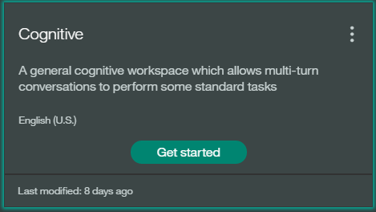

Cognitive Watson Bluemix Starter Application
======================================

### Cognitive Watson in Bluemix

This repository is an example Natural Language Interface for Things application that includes a Node.js and/or Node-RED backend services connected to various client devices such as Android, iOS and Raspberry Pi.

### Steps to deploy
1. Open an account on BlueMix
2. Subscribe to below services
  - Cloudant NoSQL DB
  - Conversation
  - Speech to Text
  - Text to Speech
  - Internet of Things Platform
- Train the Conversation workspace.
### Steps

  1. Navigate to your Bluemix console.

  2. From the **All Services** section, click the Conversation service named `cognitive-conversation` in the **Services** list.

  3. On the Service Details page, click the **Launch tool**.

  4. You can start creating a new workspace for your application or import an existing workspace.

  5. To import click **Import** in the Conversation service tool.

  6. Specify the example cognitive workspace JSON file in the location:

  `<project_root>/training/cognitive-workspace.json`

  7. Select **Everything (Intents, Entities, and Dialog)** and then click **Import**. The example cognitive workspace is created.

  8. Click the menu icon in the upper-right corner of the workspace tile, and then select **View details**.

  

  9. Click the  icon to copy the workspace ID to the clipboard.

  10. Go to **Runtime** view in the application created and add the copied workspace ID as a new user defined environment variable named CONVERSATION_WORKSPACEID under the **Environment Variable** tab
This can be deployed into Bluemix with only a couple clicks. Try it out for yourself right now by clicking:

4. 

This starter application includes the following Watson and Internet of Things services integrated:

- Cloudant NoSQL DB

A fully managed data layer designed for modern web and mobile applications that leverages a flexible JSON schema.

- Conversation

Adds a natural language interface to your application to automate interactions with your end users.

- Speech to Text

Low-latency, streaming transcription.

- Text to Speech

Synthesizes natural-sounding speech from text.

- Internet of Things Platform

The service lets your apps communicate with and consume data collected by your connected devices, sensors, and gateways.

### Before you begin

Create a Bluemix account
* [Sign up][sign_up] in Bluemix, or use an existing account. Your account must have available space for at least 1 app and 6 services.

### How does this work?

When you click the button, you will be taken to Bluemix. The name of the application will be pre-filled however you type your own name for your application, select the server and development space. Click the DEPLOY button and the application will be deployed with all examples included.

It will automatically create an instance of the defined services above, named as `cognitive-service-name` and binded to your app. If you deploy multiple instances this repository, they will share the one instance of the different services.

### Modifying the app

After you have the app deployed and running, you can explore the source files and make changes. Try the following:

* Modify the app logic in [Node-RED through the flow editor][node-red]
* Modify the app logic in Node.js by editing .js files
* Modify the .html file to change the appearance of the app page
* Use the [Conversation tool to train the service][train_conversation] for new intents and entities, or to modify the dialog flow.

[sign_up]: https://console.ng.bluemix.net/registration/
[node-red]: https://github.com/vincebhleo/cognitive-bluemix-starter/tree/master/defaults#cognitive-node-red-flow
[train_conversation]: https://github.com/vincebhleo/cognitive-bluemix-starter/tree/master/training#training-the-conversation-workspace
